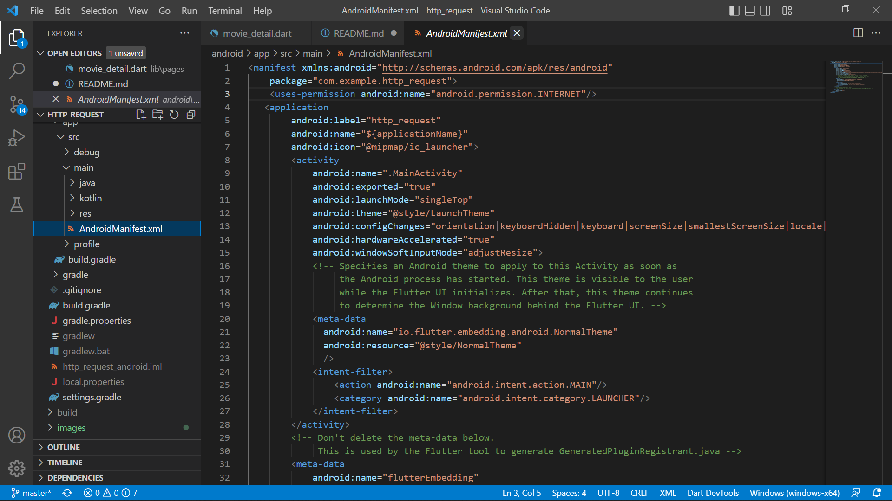

# **Tugas Pertemuan 24**
## **Project http_request**

### Praktikum 1 : Api Key dari themoviedb.org

### Praktikum 2 : Library Flutter http
* menambahkan library menggunakan plugin vscode pubspec assit

### Praktikum 3 : Koneksi ke REST API
* Menguji koneksi di dashboard api themoviedb

* Mengkoneksikan Aplikasi Flutter ke themoviedb dengan package http

* Ubah MyHomePage menjadi stateless widget.

Buat file baru baru “pages” pada folder lib dan buat sebuah file dengan nama movie_list.dart.

tampilan file http_service.dart.

Pada langkah ini kita sudah berhasil mendapatkan response dari REST Api ke widget
text namun belum tampil dengan baik karena belum menggunakan listview dan models. Selanjutnya kita persiapkan sebuah file models dan listview.

* Membuat model untuk response http
Buat folder models didalam folder lib dan isikan dengan file movie.dart Berikut adalah tampilan file movie.dart pada langah ini

berisi sebuah class movie lengkap dengan variabel dan construktor, juga sebuah function untuk mengkonversi json menjadi response yang sesuai dengan class movie.
Selanjutnya update function http_service.dart menjadi seperti ini

* Membuat halaman list Populer Movie
Mengupdate inisialisasi variabel, serta menambahkan method initialize() pada class movieliststate. Lanjut membuat listview dan card berdasarkan data dari initialize. Sehingga coding yang ada pada file movie.list.dart berisi seperti ini.

* Membuat halaman detail Populer Movie
Untuk membuat perpindahan dari movie list ke movie detail buatlah onTap event di
listview pada movie list.

Pada event on tap Widget MovieDetail belum dibuat, buatlah widget ini pada folder
pages/movie_detail.dart.

Lengkapi Movie Detail untuk menerima parameter Movies, lalu juga lengkapi detail widget. Sehingga kode akan tampak seperti ini.

### **Hasil Run Project http_request**

